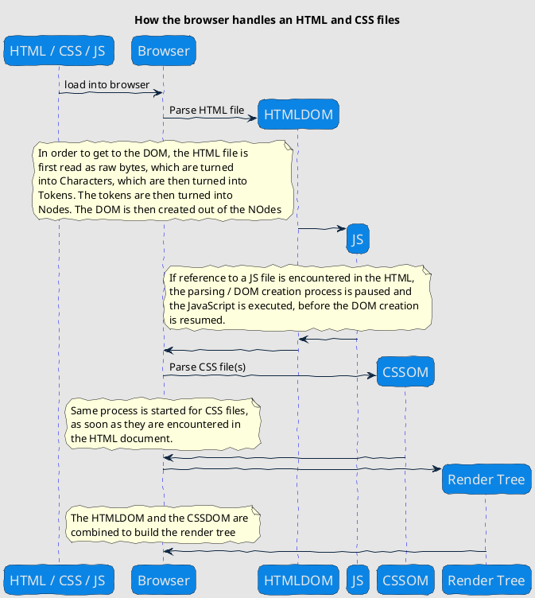
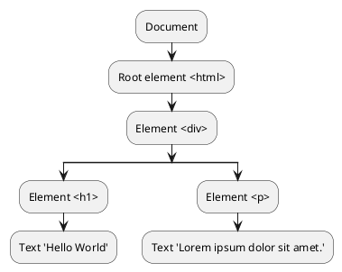
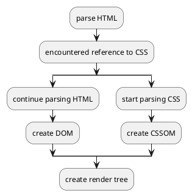

### How does the Browser render HTML?
#### Quick overview


#### From files to nodes
The browser engine is reading the HTML file as raw Bytes. In order to turn the code into something usable, the Bytes are first turned into characters. This is basically the HTML again, letter for letter.

Those characters are then read and turned into tokens, which is to say, the file is parsed into chunks.
The browser engine recognizes the code and creates tokens based on the code.  

In this step, the browser is starting to sort the HTML in parent / child relationships.

Finally, the tokens are turned into nodes, which represent the tree model of the HTML file.

#### What is the DOM?
Basically, the DOM is the basis for the browser to render a document. It is how the browser understands, where the individual elements are located in relation to one another



#### Combine DOM with CSSOM to create the render tree
The browser does a similar parsing process for the CSS and creates another model, the CSSOM. These to models are the 
then combined into the render tree, which is what is finally used to render something on screen.



#### How to manipulate the DOM

The browser passes a global `document` Object to its JavaScript engine, so that this Object is available to any JS file running in a browser window.

*How the JS engine works in particular is content of another class.

With this `document` Object, we can now access the DOM elements inside our JS code like so:

```javascript
const header = document.getElementsByTagName('h1')
```

While this works on smaller scales, it gets unperformant and difficult to manage as soon as the DOM gets to a certain size.

#### Task: Create a small app
Requirements: Provide an input to enter text and a submit button. On submission, the text is appended to
the `` to get an image from robohash.org.


### Transfer
While our solution with vanilla JS worked, it does not scale that good. Traversing the DOM to select elements and reacting to state changes is costly and will lead to slow performance at a certain point.

On top of that, our code gets rather convoluted pretty quickly.

So what can we do?

#### Virtual DOM to the rescue
A virtual DOM is a representation of the DOM in memory. It effectively decouples the JS rendering logic from the DOM.

*(This is helpful to achieve server-side rendering with JS)

This is an example of virtual nodes.
```javascript
{
    tag: 'div',
    props: {
        class: 'container',
        label: ''
    },
    children: [
        {
            tag: 'h1',
            props: {},
            children: []
        },
        {
            tag: 'p',
            props: {},
            children: 'Lorem ipsum dolor sit amet.'
        }
    ]
}
```

```javascript
{
    tag: 'div',
    props: {
        class: 'container',
        label: ''
    },
    children: [
        {
            tag: 'h1',
            props: {},
            children: 'Goodbye World'
        },
        {
            tag: 'p',
            props: {},
            children: 'Lorem ipsum dolor sit amet.'
        }
    ]
}
```

These will be rendered like so:
```html
<div class="container">
    <h1>Hello World</h1>
    <p>Lorem ipsum dolor sit amet.</p>
</div>
```

A virtual node consists of:
- The HTML tag as a *String*
- An *Object* of properties (Attributes like class names, id, etc.)
- An *Array* or a *String* of children
	- The *Array* contains a list of nodes
	- A *String* is text content

#### Setting up our virtual DOM engine
To get the basics running we need the following functionality:
- A function to create a node. This function takes the individual parts that are described above and combines them into an *Object*.
- A function that mounts our node to the DOM
- A function to unmount a node from the DOM
- A function to patch a node with another. It needs to compare two different nodes and recursively check for all the diferences between the two.

```javascript
    // Create virtual node
    function h(tag, props, children) {
        // Return the virtual node
    }

    // Mount a virtual node to the DOM
    function mount(vnode, container) {
        // Create the element
        // Set props
        // Handle children
        // Mount to the DOM
    }

    // Unmount a virtual node from the DOM
    function unmount(vnode) {
        // Unmount the virtual node
    }

    // Take 2 vnodes, compare & figure out what's the difference
    function patch(n1, n2) {
        // Case where the nodes are of the same tag
        // Case where the new vnode has string children
        // Case where the new vnode has an array of vnodes
        // Case where the nodes are of different tags
    }
```

Then we can use `patch` in our App with a `render` function.


